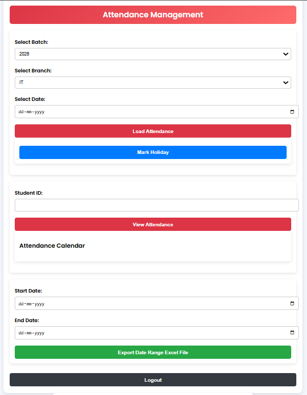

# 📚 Student Attendance Portal

A facial recognition and geolocation based attendance system with real-time database storage and a mobile-friendly admin/student dashboard.

---

# 📖 Table of Contents

* [🛠 Install Visual Studio with C++ Compiler](#-install-visual-studio-with-c-compiler)
* [🚀 How to Set Up and Run](#-how-to-set-up-and-run)

  * [1. Clone the Repository](#1-clone-the-repository)
  * [2. Create and Activate a Conda Environment](#2-create-and-activate-a-conda-environment)
  * [3. Install Dlib](#3-install-dlib)
  * [4. Install Project Requirements](#4-install-project-requirements)
  * [5. Configure Firebase, ImageKit, and Environment Variables](#5-configure-firebase-imagekit-and-environment-variables)

    * [5.1 Download serviceAccountKey.json](#51-download-serviceaccountkeyjson)
    * [5.2 Create a .env File](#52-create-a-env-file)
  * [6. Set Up Your Database and Storage](#6-set-up-your-database-and-storage)

    * [6.1 Student Database](#61-student-database)
    * [6.2 Admin Location Database](#62-admin-location-database)
  * [7. Generate Face Encodings](#7-generate-face-encodings)
  * [8. Run the Server Locally](#8-run-the-server-locally)
  * [9. Access on Mobile (Better Location Accuracy)](#9-access-on-mobile-better-location-accuracy)
* [Done! You're all set to use the student attendance portal](#done-youre-all-set-to-use-the-student-attendance-portal)
* [Features](#features)
* [UI Screenshots](#ui-screenshots)

---

## 🛠 Install Visual Studio with C++ Compiler

Before starting, install **Visual Studio Community** from [here](https://visualstudio.microsoft.com/vs/community/).
While installing, make sure to **select the workload**:

**✅ "Desktop development with C++"**

This installs the **MSVC (Microsoft C++ Build Tools)** required for building and installing libraries like **dlib**.

---

## 🚀 How to Set Up and Run

### 1. Clone the Repository

```bash
git clone https://github.com/Rohit131313/Smart-Attendance-System-with-Dual-Authentication-Geolocation-and-Face-Recognition.git
cd Smart-Attendance-System-with-Dual-Authentication-Geolocation-and-Face-Recognition
```

---

### 2. Create and Activate a Conda Environment

```bash
conda create -n attendance-portal python=3.12
conda activate attendance-portal
```

---

### 3. Install Dlib

Download the appropriate `.whl` file for your Python version from [this link](https://github.com/z-mahmud22/Dlib_Windows_Python3.x).
and run 

```bash
python -m pip install filename.whl
```

Or install directly (for Python 3.12, Windows 64-bit):

```bash
python -m pip install dlib-19.24.99-cp312-cp312-win_amd64.whl
```

---

### 4. Install Project Requirements

```bash
pip install -r requirements.txt
```

---

### 5. Configure Firebase, ImageKit, and Environment Variables

#### 5.1. Download `serviceAccountKey.json`

* Go to your [Firebase Console](https://console.firebase.google.com/).
* Select your project.
* Navigate to **Project Settings** > **Service Accounts**.
* Click **Generate New Private Key** → It will download the `serviceAccountKey.json` file.
* 📄 *This file contains your Firebase project’s secret keys and credentials needed for server-side authentication.*

#### 5.2. Create a `.env` File

In your project root directory, create a `.env` file and add these environment variables:

```
IMAGEKIT_PUBLIC_KEY=your_imagekit_public_key_here
IMAGEKIT_PRIVATE_KEY=your_imagekit_private_key_here
IMAGEKIT_URL_END_POINT=your_imagekit_url_endpoint_here
DATABASE_URL=your_firebase_database_url_here
FIREBASE_SERVICE_ACCOUNT_KEY_JSON=copy and paste the content of path_to_your_serviceAccountKey.json file
```

**Note:**

* `DATABASE_URL` is your **Firebase Realtime Database URL** (like `https://your-project-id.firebaseio.com/`).

---

### 6. Set Up Your Database and Storage

#### 6.1 Student Database

* Use the `AddDatatoDatabase.py` file provided to populate your **Firebase Realtime Database** for students.
* The database should follow this format:

```json
{
  "Students": {
    "1": {
      "absent": 1,
      "attendance": {
        "2025-04-16": "absent"
      },
      "batch": "2026",
      "email": "a1@gmail.com",
      "holiday": 0,
      "last_attendace_time": "2025-04-16 09:06:36",
      "major": "IT",
      "name": "a",
      "present": 0,
      "profile_image": "imagekit_url_endpoint/students/1.jpg",
      "total_attendance": 0,
      "uid": "uid should be entered here"
    }
  }
}
```
* Enable Firebase Authentication and create users for each student.
* Store each student's UID inside the database under their record.
* Upload each student's image to ImageKit inside the students/ folder.
* Update each student's profile_image URL according to their uploaded ImageKit image.

**Run the file:**

```bash
python AddDatatoDatabase.py
```
---

#### 6.2 Admin Location Database

* Use the `AddAdminDatabase.py` file to create the **AdminLocation** database in Firebase.
* This database stores **latitude**, **longitude**, and **radius** of the admin location for geolocation-based attendance validation.

**Example Firebase Structure:**

```json
{
  "AdminLocation": {
    "latitude": ,   # Put with your admin's/college latitude
    "longitude": ,  # Put with your admin's/college longitude
    "radius": 100          # in meters
  }
}
```

**Run the file:**

```bash
python AddAdminDatabase.py
```

---

### 7. Generate Face Encodings
After uploading all student images to **ImageKit**, run the following command to generate face encodings for each student. These encodings will be stored in a `.pkl` file, which will later be used during the attendance marking process.

```bash
python EncodeGenerator.py
```

---


### 8. Run the Server Locally

```bash
python app.py --host=0.0.0.0 --port=5000
```

Then open [http://127.0.0.1:5000/](http://127.0.0.1:5000/) or [http://localhost:5000](http://localhost:5000) on your **laptop browser**.

---

### 9. Access on Mobile (Better Location Accuracy)

* Open a second terminal.
* Activate the environment again:

```bash
conda activate attendance-portal
```

* Start **ngrok**:

```bash
ngrok http 5000
```

* Copy the generated **ngrok URL** (e.g., `https://randomid.ngrok-free.app`).

* Update `BASE_URL` inside these files:

  * `templates/index.html`
  * `static/adminDashboard.js`

* Now open the **ngrok URL** on your mobile browser.

---

# Done! You’re all set to use the Student Attendance Portal

## Features

### 👨‍🎓 **Student Portal**

* **Two-Step Authentication Attendance Marking** – Ensures security before marking attendance.
* **Personalized Dashboard** displaying:

  * Profile picture
  * Name, Scholar Number, Batch, and Major
  * **Total Classes** and **Classes Attended** count
  * **Attendance Percentage** with real-time updates
  * **Interactive Attendance Calendar** with color-coded status:

    * 🟩 **Present** – Green
    * 🟥 **Absent** – Red
    * ⬜ **Holiday** – Gray
    * 🟦 **Marked by Teacher** – Blue
  * Teacher’s remarks for specific dates, shown under the calendar.


---

### 👩‍🏫 **Admin / Teacher Portal**

* **Secure Login** via Admin Portal to manage all student attendance records.
* **View & Manage Attendance**:

  * Load the **complete attendance list** for all students with remarks for a selected date.
  * Mark **Holiday** for all students on a particular date.
  * Load **calendar view** for any individual student, identical to the student’s dashboard view.
* **Download Reports**:

  * Export attendance records for a specific date range (all students) to an **Excel file**.
* **Edit Attendance**:

  * In the attendance table view, **click the status cell** of the desired student’s row to change their status (**Present**, **Absent**, **Holiday**) for that date.
  * Add **remarks** while editing so students can view them in their dashboard.


## UI Screenshots

### 1️⃣ Marking Attendance Page


---

### 2️⃣ Student Login Page


---

### 3️⃣ Admin Login Page


---

### 4️⃣ Student Dashboard


---

### 5️⃣ Admin Dashboard




